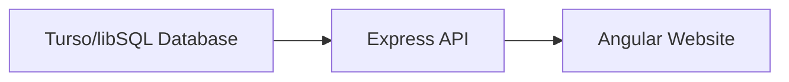
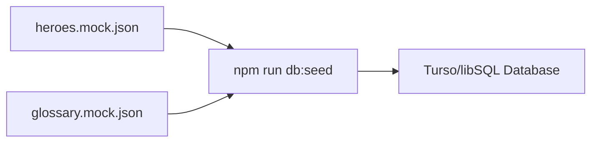
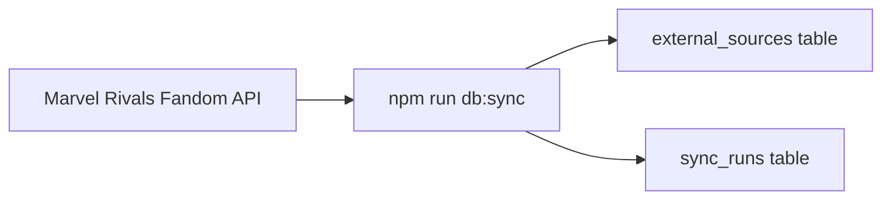
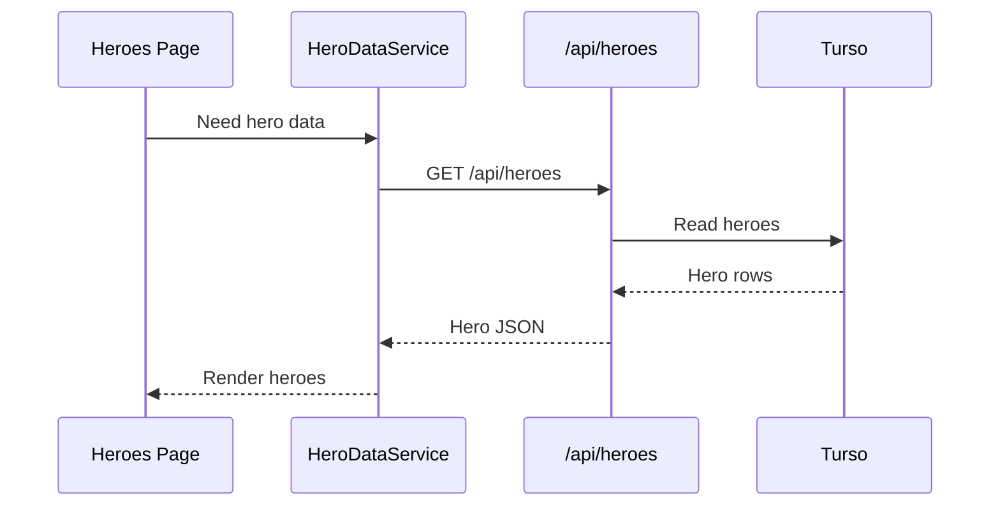
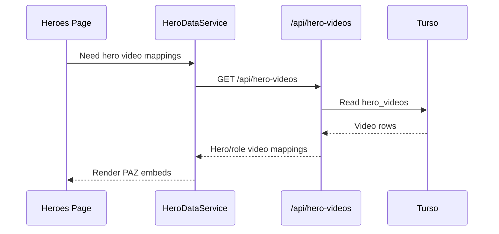
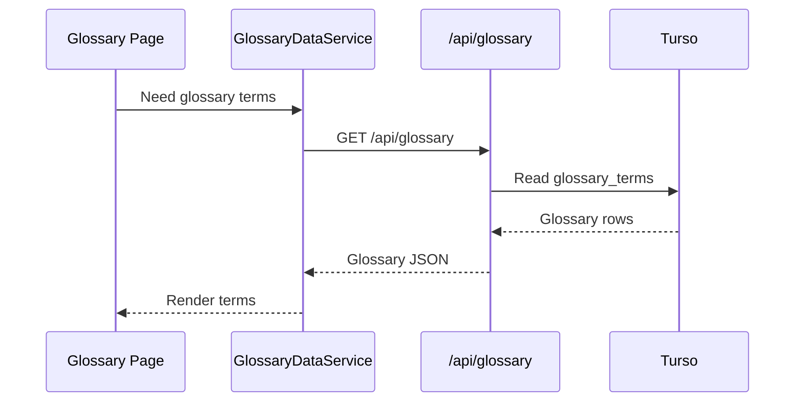
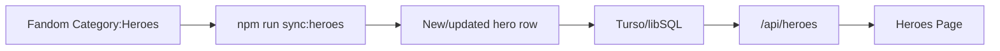
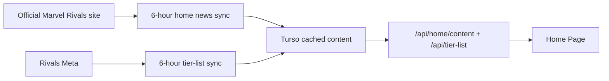

# Content Data Flow

This page explains where the site content comes from, where it is stored, and how the website reads it.

## Short Version

The website should read content from the shared Turso/libSQL database.



That is the main idea.

The JSON files and wiki API calls are used to fill or update the database.

## The Three Jobs

There are three separate jobs in the content system.

| Job | What It Does | Main Files |
| --- | --- | --- |
| Seed | Copies local JSON data into Turso | `scripts/seed-sqlite.mjs` |
| Sync | Fetches outside data from official, stats, and Fandom/wiki sources | `scripts/sync-external-sources.mjs`, `scripts/sync-home-news.mjs`, `scripts/sync-tier-list.mjs` |
| Hero Sync | Finds current Fandom heroes and updates Turso heroes | `scripts/sync-heroes.mjs` |
| Read | Lets Angular pages get data from Turso | `src/server.ts`, `src/content-database.ts` |

## 1. Seed Data

Seed data is your starting content.

These files are seed data:

- `data/seeds/heroes.mock.json`
- `data/seeds/glossary.mock.json`

They are not the main runtime source anymore.

When you run:

```bash
npm run db:seed
```

the seed script copies those JSON files into Turso.



After that, the website reads from Turso, not directly from those JSON files.

## 2. Wiki/API Sync

Some data comes from outside sources, like the Marvel Rivals Fandom API.

When you run:

```bash
npm run db:sync
```

the sync script fetches external data and saves the raw response in Turso.



Right now the sync script stores these external sources:

- `fandom-battlepasses`
- `fandom-deadpool`
- `fandom-deadpool-abilities-template`

The `sync_runs` table keeps a history of whether each update worked or failed.

## 3. Website Reads

When a user opens a page, Angular asks the Express API for content.

For heroes:



For hero videos:



For glossary:



## What Each Piece Means

### Turso Database

The shared content database is configured with:

```text
TURSO_DATABASE_URL
TURSO_AUTH_TOKEN
```

It stores heroes, abilities, glossary terms, and cached external API responses.

### Express API

The Express server exposes database data through routes:

```text
GET /api/heroes
GET /api/heroes/:id
GET /api/hero-videos
GET /api/home/content
GET /api/home/portals
GET /api/glossary
GET /api/external-sources/:sourceKey
GET /api/content/status
```

These routes are defined in:

```text
src/server.ts
```

They read the database through:

```text
src/content-database.ts
```

### Angular Services

Angular pages should not read Turso directly.

They use services:

```text
HeroDataService -> GET /api/heroes
GlossaryDataService -> GET /api/glossary
```

The services then give the page data to display.

## Update Commands

Use this when you changed local JSON seed files:

```bash
npm run db:seed
```

Use this when you want to refresh external wiki/API data:

```bash
npm run db:sync
```

Use this when new heroes are released or hero pages change:

```bash
npm run sync:heroes
```

Use this when you want to do both:

```bash
npm run content:update
```

`content:update` now runs seed, external sync, and hero sync.

## New Hero Flow

When a new hero appears on Fandom:



If the new hero does not have a local portrait yet, the site uses `default-hero.png` until you add an image.

## Current Status

Already database-backed:

- Heroes page
- Glossary page
- Home page most-used heroes, official updates, latest tuning, and events/rewards



The season dashboard and season glance render only content returned by `/api/home/content` and
`/api/tier-list`; neither contains local content fallbacks.
`SeasonGlanceService` composes the cached official content for the glance component, while
`SeasonDashboardService` composes cached official content with the tier-list endpoint for the
dashboard component. `HomePageComponent` only composes those components and owns video behavior.

That would make the home page use the same database-backed flow as the rest of the site.

## Mental Model

Think of it like this:

```text
JSON files and wiki APIs fill Turso.
Turso feeds the API.
The API feeds the Angular pages.
```

Or shorter:

```text
Sources -> Turso -> API -> Website
```
